# Faultline

A live seismograph of the planet, on top of the [USGS earthquake catalogue](https://earthquake.usgs.gov/earthquakes/feed/), which gathers what the global and US regional seismic networks locate: around two hundred events on an ordinary day.

Read the last 24 hours the way a drum seismograph draws them, one line per hour and one burst per event, and point at any burst, even one too small to see, for what it was. Set the day's sizes against an average day on Earth, filter, search and sort the log of every event, then open any event for its magnitude scale, how its depth was found, the uncertainty of its location and the energy it released. Any search of the catalogue, an event's aftershocks included, exports as a spreadsheet or as map data.

In English and in Portuguese. Angular 22, zoneless with signals, SSR with incremental hydration in each language, and an Express backend-for-frontend.

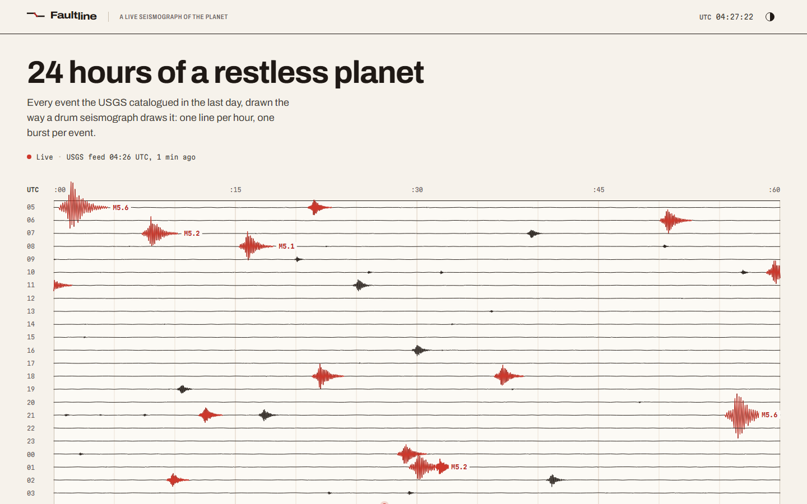

<details>
<summary>More screens</summary>

**The same record on film, the dark theme**

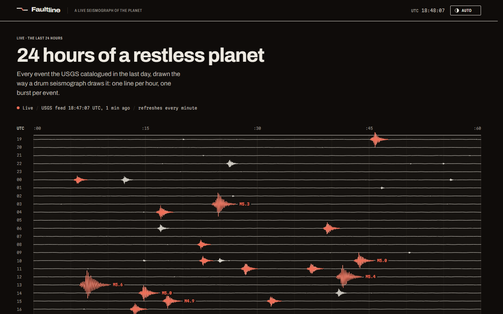

**The whole page: readouts, the map and every event**

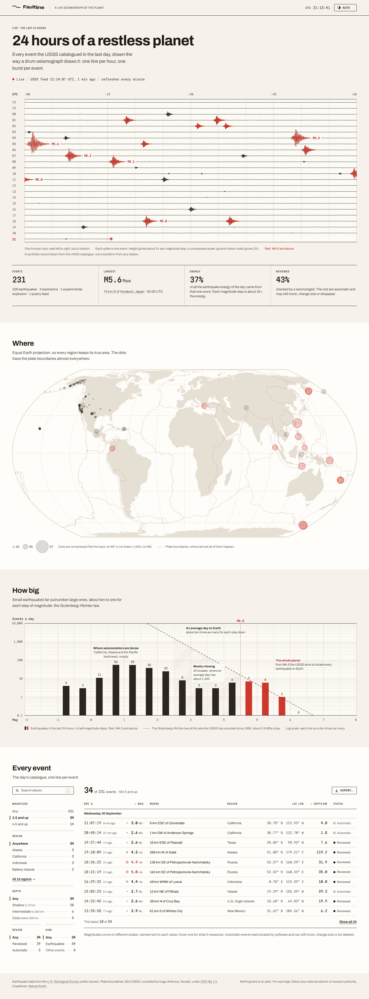

**The log, filtered to one region and sorted by size, dark theme**

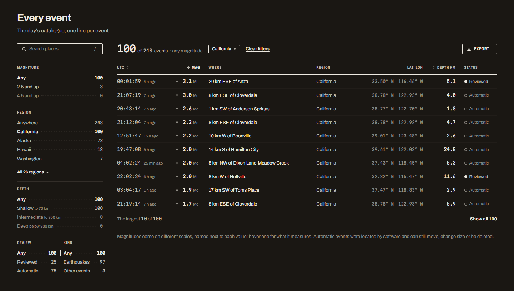

**The log's filters on a phone, in a sheet over the list**

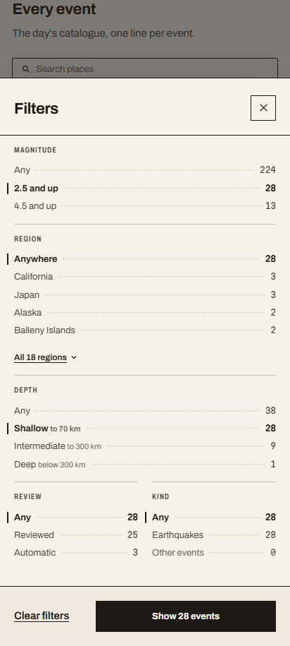

**Reading an event off the trace**

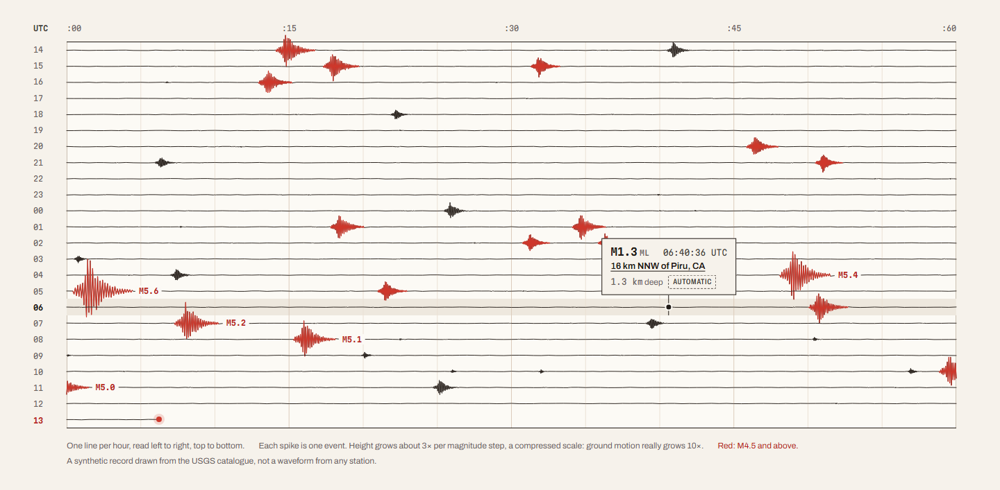

**The day's sizes against an average day on Earth, dark theme**

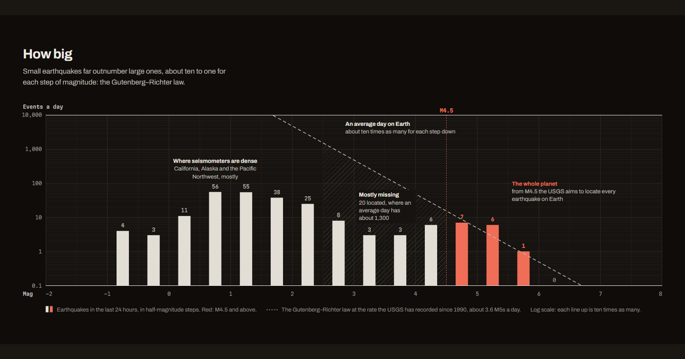

**One event, with its uncertainty**

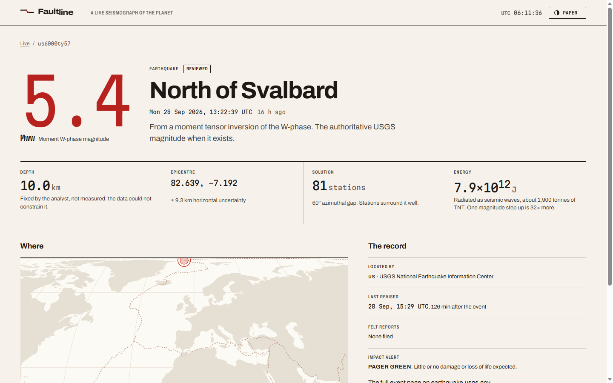

**The same event in Portuguese**

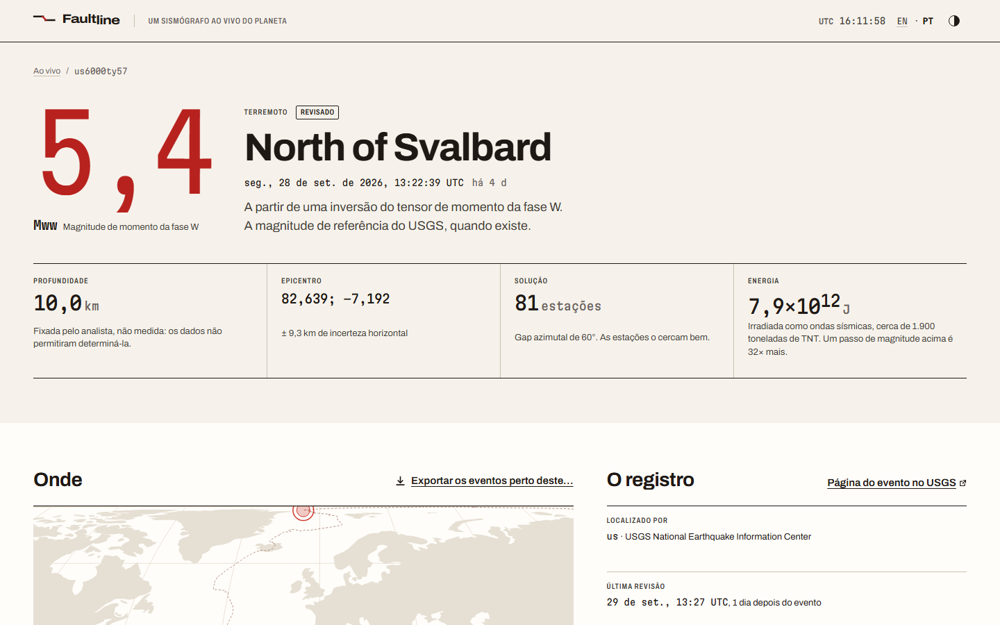

**On a phone, dark theme**

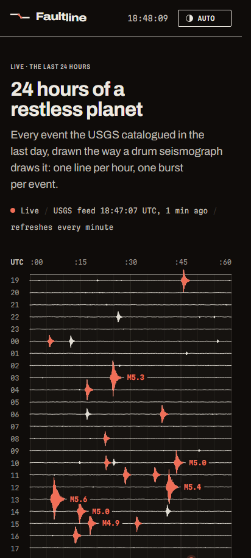

**Exporting the aftershocks of an event**

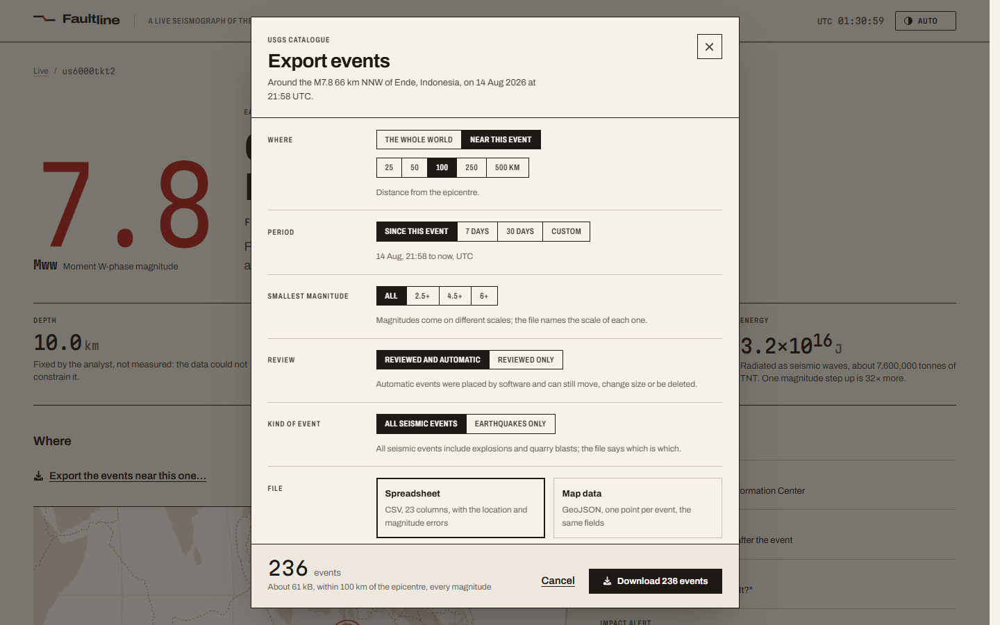

**A search too large for one file, dark theme**

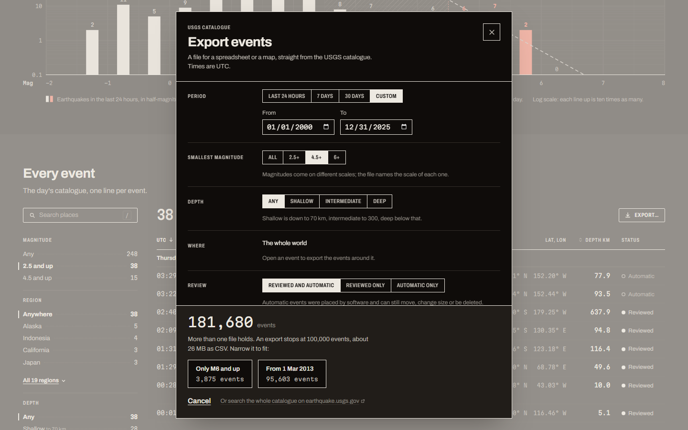

Regenerate with `pnpm run screenshots` against a production build.

</details>

---

## Setup

Node.js 22.13 or newer and pnpm. No API key or account.

```bash
pnpm install
pnpm dev
```

The app itself runs on Node.js 24.15 or newer, which the Angular 22 CLI requires, pinned in `package.json` under `devEngines`. The first install downloads that exact version, checked against the hash in the lockfile, and every script runs on it, so the Node on the machine only has to start pnpm.

To run the production server:

```bash
pnpm build
NG_ALLOWED_HOSTS=faultline.example.com pnpm preview
```

Angular's server refuses requests for hostnames it was not told about, as protection against server-side request forgery. `localhost` is allowed in `angular.json`; anything else comes from `NG_ALLOWED_HOSTS`. Everything else has a default:

| Variable | Default | What it is for |
| --- | --- | --- |
| `PORT` | `4000` | The port the server listens on |
| `NG_ALLOWED_HOSTS` | none | Hostnames to answer for besides `localhost`, comma-separated |
| `TRUST_PROXY` | off | Express `trust proxy`. Set it behind a proxy, or every client shares the proxy's address and its rate limit |
| `RATE_LIMIT_BURST` | `60` | Requests one client can make at once, page renders and API calls alike |
| `RATE_LIMIT_PER_SECOND` | `1` | How fast that allowance refills |
| `USGS_BASE_URL` | `https://earthquake.usgs.gov` | Where the USGS is. The end-to-end suite points it at a stub |
| `UPSTREAM_USER_AGENT` | `Faultline/0.1 (+repo URL)` | Sent with every USGS request, so the provider can reach the operator before reaching for a block list |

---

## Why this data set

The USGS catalogue is live, public domain and regenerated every minute, and it is honest about how unsure it is. That was the point of picking it. Most of what is interesting in this repository comes from carrying that uncertainty through to the page instead of flattening it into a tidy dashboard.

Magnitude is not one scale. A single day of the feed mixes six of them, measured from different parts of the seismogram and valid over different sizes, so a 3.1 from a Californian network and a 3.1 from the global one are not the same statement. Every value here carries its scale, and the scale explains itself. About half of the same day is still provisional: automatic solutions can move, change size or be deleted, so reviewed and automatic events look different everywhere they appear.

Depths are unsure in two directions. Many are fixed by an analyst when the data cannot constrain them, typically at 10 km, and some are negative, because shallow events under high ground are located relative to sea level. The event page says which, instead of printing a number as if it had been measured.

---

## Screens

| Route | What it is |
| --- | --- |
| `/` | The last 24 hours: the helicorder, the day's readouts, the map, the day's sizes against an average day, every event, and an export of any search |
| `/?mag=any&region=alaska&sort=largest` | The same page with the log filtered, searched or sorted: `mag` (`any`, `2.5` by default, `4.5`), `region`, `depth` (`shallow`, `intermediate`, `deep`), `review` (`reviewed`, `automatic`), `kind` (`earthquake`, `other`), `q` for a place, and `sort` (`largest`, `deepest`) |
| `/?rows=all` | The same page with the log unfolded past its latest ten events |
| `/quakes/:id` | One event: magnitude and its scale, depth and how it was found, location uncertainty, energy, impact alert, and an export of the events around it |
| `/pt/…` | Any of them in Portuguese, its filters under the same names |

---

## How it is built

- **A BFF, not a proxy.** Express routes, mounted in the Angular SSR server, read two USGS services that answer the same questions differently, validate every record with Zod at the boundary, and hand the app one contract (`src/shared/api/contracts.ts`). A malformed record costs one row, not the feed, and the response says how many were skipped.
- **The domain comes first.** `src/shared/domain` owes nothing to the feed's field names. Magnitude scales follow the USGS's own definitions, energy is computed from magnitude, about 32 times more per whole step, and an explosion is counted as a seismic event but never ranked as the largest earthquake of the day.
- **SSR never calls itself over HTTP.** During a server render, `HttpClient` requests to `/api/*` are answered in-process by the same router Express uses, through a replacement `HttpBackend`. Behind a load balancer, the alternative is every page render leaving the machine to ask the same process for data it already holds. Because the swap happens below the interceptors, Angular's transfer cache still hands the response to the browser, which does not refetch on hydration. That cache drops error responses, so a small interceptor hands those over too: a missing event or a feed outage hydrates as it was rendered, with the status it was rendered with.
- **Cached, paced and honest about failure.** Each feed is fetched at most once a minute however many people are reading, and concurrent misses share one upstream call. When the USGS stops answering, the last good copy is served and flagged, and the page says how old it is. Each client address gets a token bucket, bursts of 60 and then one request a second, and every USGS call the cache cannot answer, event lookups, counts and export pages alike, shares one budget for the whole process, so however many addresses a script rotates through, the USGS sees at most ten calls at once and two a second after that.
- **The live page is pushed what changed, never polled.** While anyone reads a feed, one hub on the BFF watches its cache and sends each open tab, as server-sent events, only what changed since the copy that tab holds: the few events a minute brings, not the whole day again. A page starts from the copy it was rendered with and names its version as it connects, so a hydrated page downloads nothing it already has, and a dropped stream resumes the same way from the browser's `Last-Event-ID`. The feed is an `httpResource` the stream writes into rather than an `rxResource` over the stream, since a stream resource cannot start from the server's copy: it would hydrate in its waiting shape. A hidden tab lets its stream go, because a browser holds only six connections to a site over HTTP/1.1, and asks for what it missed when it is back. Each message is flushed past the compression middleware, which would otherwise hold it until its buffer filled.
- **An export holds every match, or it does not start.** The dialog counts a search as it is narrowed, and one past 100,000 events is refused before the first byte, with two narrower searches that fit, each counted before it is offered. The file streams from the BFF as the USGS pages arrive, keyed by time rather than offset, since events landing mid-export would shift every offset after them, and a failure halfway cuts the connection, so a truncated file never passes for a whole one. The CSV opens in Excel with its accents intact, and a cell that starts like a formula is written as text.
- **The helicorder is synthetic, deterministic and says so.** No station hears the whole planet and the feed carries no waveforms, so each event becomes a burst placed at its origin time and sized from its magnitude, on a compressed scale the legend states. The paths are a pure function of the events and the clock, so the server and the browser draw the same thing.
- **Any burst can be read, by pointer, finger or keyboard.** The trace is one path per hour, so there is nothing on it to hover. A point is matched to the nearest burst instead, anywhere along its length and within a reach that grows for a finger, which is the only way to find most small events: they barely move the line. The card stays up while the pointer moves onto it and closes with Escape, as WCAG 1.4.13 asks of content shown on hover. To the keyboard the trace is a slider over the day's events, whose value names the event read, so a screen reader hears what the card shows.
- **The day's sizes are set against the law, not just counted.** On its own, a day of the feed holds fewer M3s than M4.5s, as if the planet made few of them. Drawn on semi-log paper against the Gutenberg–Richter law, anchored on the counted rate of M5s, the chart shows what the catalogue can hear: every earthquake from about M4.5, the NEIC's goal for the world, and below that only what a dense regional network caught, named by region. The stretch between is hatched, with how many it holds against how many an average day brings.
- **The map is a file, not a library.** Coastlines and plate boundaries are projected to Equal Earth once, by `pnpm basemap`, into a static SVG the page references with `<use>`: cached once, outside the JavaScript bundle, and coloured by the theme through CSS. Equal Earth keeps every region at its true area, which Mercator would not for Alaska, the busiest corner of the feed.
- **Dialogs are the platform's.** `ui-dialog` is the native `<dialog>`, opened with `showModal()`: the page behind is inert, Escape and a click outside close it, and focus returns to the button that opened it, none of it reimplemented. It fades in with `@starting-style`, fills the screen on a phone with its actions under the thumb, and its code is a separate chunk, fetched when the browser is idle and rendered on the first click. A menu is the platform's too: `ui-popover` is the native popover, hung from its button by CSS anchor positioning, so the theme menu opens before the page has hydrated, and each theme in it previews a scrap of the drum by setting only `color-scheme`.
- **Motion plays four parts, and a page waits in its own shape.** Every duration is a role in `tokens.css`: feedback, a control answering the hand in colour alone; presence, what comes onto the page and leaves faster than it came; navigation, the cross-fade from one page to the next; and the live record, the pen and the Live dot breathing at one pace. ESLint fails a stylesheet that writes a duration of its own, and reduced motion sets every role that moves to zero in one place, so nothing travels or loops while a new row still keeps its tint. What the browser waits for is laid out first in the page's own markup and type: an event's readouts under their labels, and the drum ruled without ink, the same drum the day is then inked on, so nothing moves when the data lands. The lines still to come show only once a wait is long enough to see. Angular plays `animate.enter` while it hydrates too, so content fades in only when the browser waited for it, never when the server drew it.
- **An event opens at once.** A link to an event hands the page what its list already knows, in the navigation's state rather than a store, so the page opens on the magnitude, the place, the time, the depth and the energy while the catalogue is asked for the rest, which waits in its place. The page's code is preloaded once the first page is up, so nothing waits for that either. The magnitude read flies from the line, label or card clicked into the page's title with the View Transitions API: only that element is named, for that transition alone, and only the title's own image travels, so the digits stay sharp. Should the rest of the record not come, the page keeps what it knew and says what is missing; should the catalogue say the event is gone, it lets go of it.
- **Server state is TanStack Query, only where it is used.** The live count is one query per search, so going back to a choice answers from memory, and the last count stays up, marked provisional, while the next one loads. The query client is provided inside the dialog's chunk through an injection token, not in the app config, so the library never reaches the first load. The custom period is a Signal Form checked by the same Zod schema the BFF applies, imported as `zod/mini`, because the classic API cannot be tree-shaken.
- **The log never moves under its reader.** It opens at its latest ten events, about a screen's worth, and unfolds to the rest from a link. A new event that lands while the reader can see the log, or has scrolled past it, waits above it behind a count a screen reader hears, instead of pushing down the rows being read. Shown, the new rows are tinted for a few seconds and the first takes the focus, as the first row added by unfolding does. Below the fold nothing is held: the list is up to date by the time the reader gets there.
- **The log's view lives in the URL.** Every filter, the search, the order and the fold are query parameters bound to the page through the router, each named after what it sets and holding a word that reads on its own: `?mag=any&region=alaska&sort=largest`. A default is left out and the rest is written in one order, so one view has one address; a value the app does not know reads as its default rather than failing the page, and a parameter the page forgets to bind fails to compile. No store, no watcher. Sharing, bookmarking and the back button work with nothing written for them, and a change keeps the reader where they were instead of throwing them back to the top.
- **The log is an index, not a data grid.** Five facets, magnitude, region, depth, review and kind, list their options with the count the list would hold with that option and the other filters kept, so an option that leads nowhere says so before it is followed. The region is read out of the USGS place name, where the Californian networks write California and Mexico as codes and a remote event names only its seismic region. The search matches the place and its region without accents, so "pahala" finds Pāhala, and marks what it found. Where there is room the facets are a column beside the table, and over the table the count leads, then each filter in force as a chip that takes it off. Options and chips are links and the search is a plain form, so all of them work before the page has hydrated, and the long tail of regions opens in a native popover anchored in CSS. Narrower, the facets move into a sheet, and on a phone each event takes two lines; the table spells out its roles in its markup, since restyling rows as grids strips them in some browsers. The export opens on the same filters, as far as the catalogue can select by them, and names the ones it leaves in the log.
- **Two languages, each rendered on the server.** British English at the root and Brazilian Portuguese under `/pt` are two builds of Angular's compile-time i18n, so a page arrives whole in its language before any script runs, with no translation file to fetch and no text swapped in after the first paint. The words are translated as whole sentences, a count with a sentence for each case, and a word that changes with its place, like "Reviewed" on a tag and in a filter, is two messages. Numbers and dates are set by the locale: 5,4 and "seg., 28 de set." in Portuguese, with a true minus sign in both. Place names stay as the USGS writes them, which a Portuguese page says in its footer. Every page has its address in the other language, its filters kept, linked from the top bar and named in the head for search engines. One part of Angular's i18n broke hydration: an ICU message inside a component that repeats on the page, like a filter option's count, fails to hydrate after its first instance, because the instances share one copy of the hydration data and the first uses up its list of cases. Those counts are worded in TypeScript instead, and the hydration suite now fails on any error a page logs. A build with a sentence left untranslated fails, and `pnpm i18n` in CI also catches a translation the app no longer uses.
- **Missing data is a value, never a zero.** A magnitude not computed yet shows an em-dash, a depth fixed by an analyst says so instead of posing as a measurement, and every uncertainty sits next to the number it qualifies.
- **The design system is tokens and cascade layers.** Colours are OKLCH, declared once each with `light-dark()`, so a theme is nothing more than a `color-scheme`. The theme is a cookie the server reads, so the first paint is already right, with no inline script. Archivo and Martian Mono are self-hosted under content-hashed names, preloaded, and backed by local fallbacks whose metrics are matched with Capsize, so the swap does not move the layout. Icons are drawn for the app in the wordmark's square-ended stroke, on a 16 px grid, inlined as SVG by one component, and decoration wherever a word already says the same.
- **Pages are in bands, laid out by the grid.** Each section runs edge to edge, taking turns between the page's colour and a raised one, while its content keeps to the page's column. A page is a grid whose outer tracks are the gutters, and each band a subgrid across all three, so no wrapper repeats the page's width and nothing in a band can drift out of line with the rest. On an event's page the map and its record sit side by side on one grid, each taking both its rows through a subgrid, so their headings share a line and their frames start and end on the same rules. On a raised band a chart is drawn on the band itself, and a page that ends on one runs straight into the footer, with no gap or rule between them.
- **Two dependencies are patched, each with its reason.** TanStack Query read one symbol off the whole `@angular/core` namespace, which kept every export of Angular in the first load: 160 kB more on every page, caught by the bundle budget, since tightened to catch the next one. It did: a library pipe used only inside a `@defer` block is imported through its package's whole namespace, which added 50 kB to the first load, most of it `@angular/common`, until the block's content became a component of the app. Angular's incremental hydration dropped a click that landed on a section already hydrating, which cost the log's Export button its first press on a slow connection. Both are `pnpm patch`es, explained in `pnpm-workspace.yaml`, and keyed so that an upgrade touching either file fails the install rather than dropping the fix.
- **Boundaries are enforced, not agreed.** ESLint rejects imports that cross layers: `src/shared` is framework-free, `src/server` never imports Angular, `src/app/ui` knows nothing about earthquakes, and the browser code only reaches the BFF over HTTP.

---

## Testing

```bash
pnpm run ci    # format, lint, types, and the unit specs with coverage
pnpm run e2e   # Playwright across two viewports, on a production build
```

The suites divide by what they can see. Vitest covers the domain, the USGS mapping, the cache, the API router, the feed's changes and the hub that streams them, the export's paging and CSV, the helicorder geometry, what a point on the trace means and the day's distribution of sizes as plain functions, and components through the DOM they render. Playwright owns what only a browser and the real server can answer: whether the page is complete before any script runs, whether hydration asks the API again, whether the feed's stream sends a reader only what it lacks, compressed and the moment it is written, which status a crawler gets for a missing event, in either language, what an outage looks like, what a downloaded file really holds, whether a burst can be read by mouse, by finger and from the keyboard, whether the log holds an event that lands in view, whether an event's page opens on what the day knew and flies its magnitude in, what still moves under reduced motion, whether a filtered, searched or sorted log renders on the server as its address asks, the search included before any script runs, and whether a Portuguese page renders in Portuguese, names its English twin to search engines and switches language with its filters kept. It runs the production server against a stub of the USGS serving a small, awkward day, searchable and exportable like the real service, and audits every page, both pages while they wait for their data, an event's page opened on what the day knew, the export dialog, a card read off the trace, the log holding a new event, the popover of every region and the filters sheet of a phone with axe against WCAG 2.2 AA in both themes, in English and in Portuguese. Six things were broken until the suite caught them: error pages refetched while hydrating, the top bar and footer sat outside any landmark, the Export button lost a press that landed while its section was hydrating, the chart's hidden table widened the page on a phone, the trace's labels were too small as targets once the trace under them became one, and no page had ever cross-faded into the next, since the router hands its hook the roots of its route trees, whose paths are all empty, so every change of page passed for a change of filter.

The first run needs the browser: `pnpm exec playwright install chromium`.

---

## Reading further

[docs/upstream-api.md](docs/upstream-api.md) compares the two USGS services the BFF reads, the summary feeds and the FDSN event service, gathered by probing the live endpoints, because they signal the same things in different ways: an event that never existed, one deleted since, and a search that matched nothing all answer differently.

Everything else is documented where it applies: a trap is a comment on the line that works around it, and the rules for changing the code are in [CLAUDE.md](CLAUDE.md).

---

## Licence

Code under MIT. Earthquake data: U.S. Geological Survey, public domain. Plate boundaries: Bird (2003), PB2002, compiled by Hugo Ahlenius, Nordpil, under the [Open Data Commons Attribution License](https://opendatacommons.org/licenses/by/1-0/). Coastlines: [Natural Earth](https://www.naturalearthdata.com), public domain.

Nothing here is an alert. For warnings, follow your national seismic or tsunami authority.
